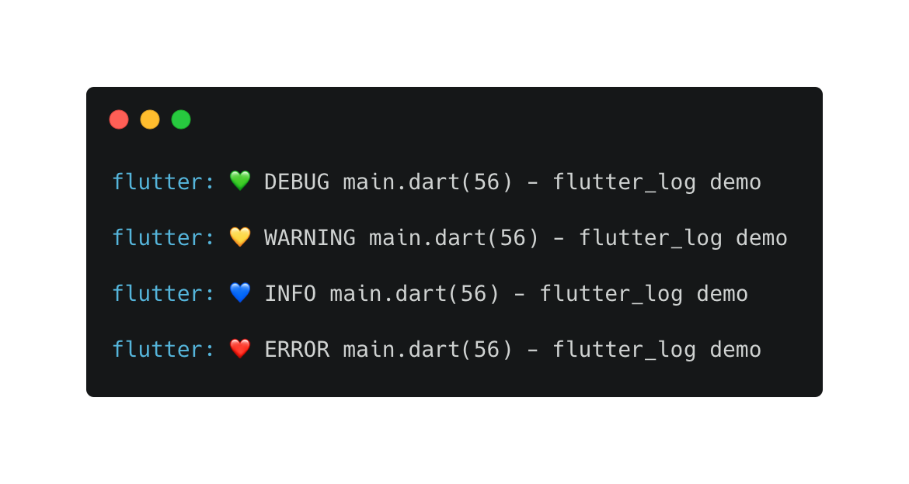

## 使用


```dart
// 直接使用FLog
FLog("flutter_log demo");

// mode：打印模式（默认值为debug）
FLog("flutter_log demo", mode: FLogMode.values[_modeIndex]);
```


`mode` 枚举如下：

```dart
enum FLogMode {
  debug,    // 💚 DEBUG
  warning,  // 💛 WARNING
  info,     // 💙 INFO
  error,    // ❤️ ERROR
}
```


## 效果



## 说明

源码中使用的 `Chain` 需要导包 `import 'package:stack_trace/stack_trace.dart';`

这个 `stack_trace` 在 `Flutter` 下自动集成，而纯 `Dart` 下没有，如果想在纯 `Dart` 下使用该功能，只需要如下添加依赖即可。

```yaml
dependencies:
  stack_trace: ^1.9.3
```


